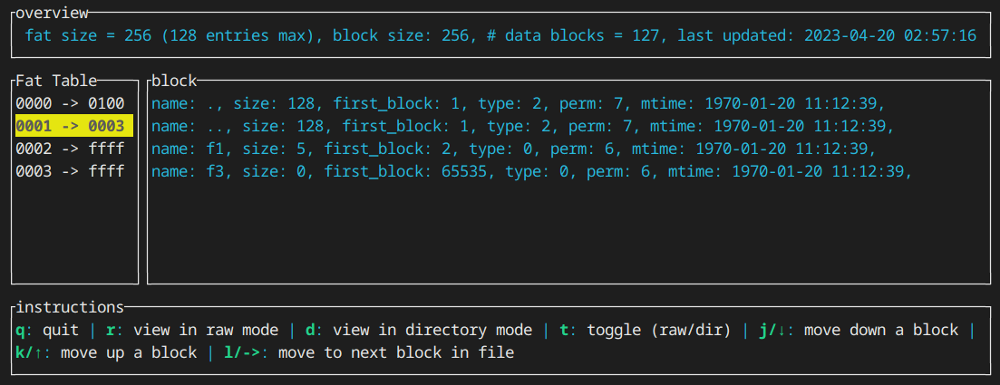
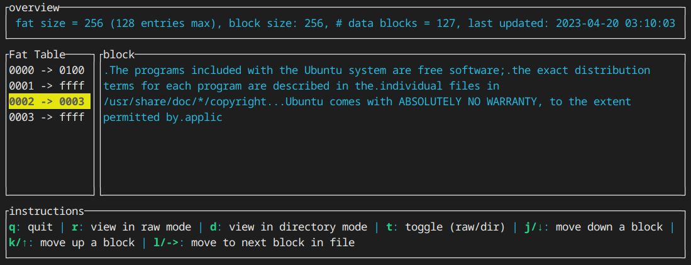

# PennFat Viewer

PFView is a simple TUI viewer for PennFat files.

## Demo

### Viewing a block as a directory block



### Viewing a block as a raw file block



## Why?

`pfview` make's it easier to debug the PennOS project's PennFAT filesystem.
The TUI's view updates automatically as the filesystem is modified, so you may have this running on another terminal as you test your program's (pennfat, pennos, or any other) file system operations, and use it to examine the state of the FAT table or any of the data blocks at any time.

## Why, really?

[Yak shaving.](https://seths.blog/2005/03/dont_shave_that/)

## Usage

```sh
cargo run ./path/to/pennfat.img
```

or if you have the binary:

```sh
./pfview ./path/to/pennfat.img
```
